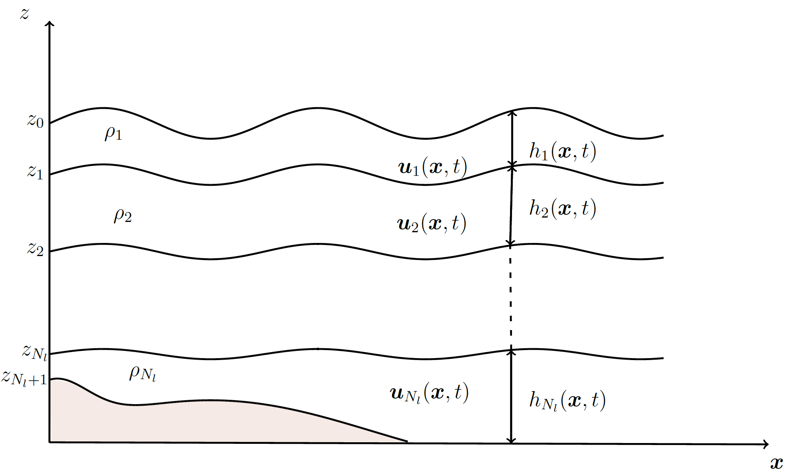
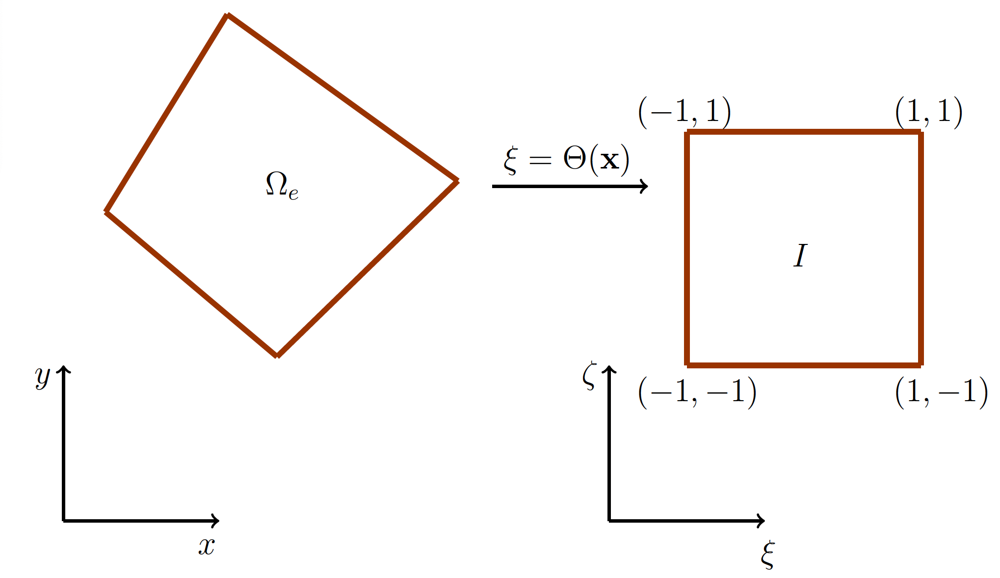

The h-NUMO Model
**********************

Governing Equations
-------------------------

We follow the derivation of the split equations from primitive equations by Higdon, 2015, and here, we only outline the final formulation for both baroclinic (layered) and barotropic equations for completeness. 

We assume the fluid is in hydrostatic balance, and shallow water equations govern each layer. :numref:`MLSWE` shows a schematic of the fluid domain diviied into :math:`N_l` layers of constant density :math:`\rho_k`, where :math:`k=1,\ldots, N_l` is the layer index increasing downward.

   Illustration of the isopycnal layered shallow water system. The quantity :math:`\mathbf{u}_k(\mathbf{x},t)` denotes the horizontal velocity, :math:`\rho_k` is the density and :math:`h_k(\mathbf{x},t)` is height of :math:`k`-th layer.

.. _sub_bcl_eqn:

Baroclinic equations
----------------------------
The two-dimensional MLSWE for the :math:`k`-th layer is given by

.. math::
   :nowrap:

   \begin{align}
      \frac{\partial \Delta p_k}{\partial t} + \nabla\cdot\left(\mathbf{u}_k\Delta p_k\right) &= 0,\\[1em]
      \frac{\partial \mathbf{u}_k\Delta p_k}{\partial t} + \mathbf{A}_k + f\mathbf{u}_k^{\perp}\Delta p_k &= -\nabla H_k + g\left(p_{k-1}\nabla z_{k-1} - p_k\nabla z_k + \Delta\tau_k\right) + \nabla\cdot(\nu\Delta p_k\nabla \mathbf{u}_k), \label{eq:layer2}
   \end{align}

where :math:`\Delta p_k` is the vertical pressure difference across layer :math:`k` (also regarded as the pressure thickness of layer :math:`k`, as :math:`\Delta p_k = \rho_k g h_k`, where :math:`h_k` is the thickness of the k-th layer and :math:`g` is the gravitational acceleration), :math:`\mathbf{u}_k = (u_k, v_k)` is the horizontal velocity in layer :math:`k`, :math:`f` is the Coriolis parameter with :math:`\mathbf{u}_k^{\perp} = (-v_k,u_k)^T` and :math:`\Delta \tau_k` is the shear stress (discussed later). :math:`z_k(\mathbf{x},t)` and :math:`z_{k+1}(\mathbf{x},t)` with :math:`\mathbf{x}=(x,y)` are the elevations of :math:`k`-th layer interfaces; we measure elevation with respect to the free surface at rest. We define :math:`p_k(\mathbf{x},t) = P(\mathbf{x},z_k,t)` and :math:`p_{k-1}(\mathbf{x},t) = P(\mathbf{x},z_{k-1},t)` as the pressures at the top and bottom of the layer :math:`k`. The term

.. math::
   :nowrap:

    \begin{equation}
        H_k(\mathbf{x},t) = g\int_{z_k}^{z_{k-1}} P(\mathbf{x},z,t) dz
    \end{equation}

is the vertical integral of the horizontal pressure force. We denote the advection term as 

.. math::
   :nowrap:

    \begin{equation*}
        \mathbf{A}_k = \frac{\partial}{\partial x} \left[u_k(\mathbf{u}_k\Delta p_k)\right] + \frac{\partial}{\partial y} \left[v_k(\mathbf{u}_k\Delta p_k)\right].
    \end{equation*}

.. _sub_btp_eqn:

Barotropic equations
----------------------------

We obtain the barotropic equations by vertical summation of the baroclinic equations and introducing barotropic variables representing the fast motion of the entire water column: 

.. math::
   :nowrap:

    \begin{equation}
        p_b = \sum_{k=1}^{N_l}\Delta p_k,
    \end{equation}

is the barotropic pressure and

.. math::
   :nowrap:

    \begin{equation}
        p_b\bar{\mathbf{u}} = \sum_{k=1}^{N_l} \mathbf{u}_k\Delta p_k,
    \end{equation}

is the barotropic momentum where :math:`\bar{\mathbf{u}}` is the mass-weighted vertical average of :math:`\mathbf{u}_k` over all layers. The barotropic equations are given by 

.. math::
   :nowrap:

    \begin{align}
        \label{eq:baro1}
        \frac{\partial p_b}{\partial t} + \nabla\cdot\left(p_b\bar{\mathbf{u}}\right) &= 0,\\[1em]
        \frac{\partial p_b \bar{\mathbf{u}}}{\partial t} + \bar{\mathbf{A}} + fp_b\bar{\mathbf{u}}^{\perp} &= -\nabla H + g\left(p_{0}\nabla z_{0} - p_{N_l}\nabla z_{N_l} + \Delta\tau \right) + \nabla\cdot(\nu\Delta p_b\nabla \mathbf{u}_b), \label{eq:baro2}
    \end{align}

where the barotropic advection term is

.. math::
   :nowrap:

    \begin{equation*}
        \bar{\mathbf{A}} = \frac{\partial}{\partial x}\left[ \begin{array}{c} 
         Q_u^x \\ Q_v^x  \end{array}\right] + \frac{\partial}{\partial y}\left[ \begin{array}{c} 
         Q_u^y \\ Q_v^y  \end{array}\right],
    \end{equation*}

with 

.. math::
   :nowrap:

    \begin{equation}
        \label{eq:baro_advec1}
        Q_u^x(\mathbf{x},t) = \sum_{k=1}^{N_l} u_k(u_k\Delta p_k), \quad Q_u^y(\mathbf{x},t) = \sum_{k=1}^{N_l} v_k(u_k\Delta p_k),
    \end{equation}

.. math::
   :nowrap:

    \begin{equation}
        \label{eq:baro_advec2}
        Q_v^x(\mathbf{x},t) = \sum_{k=1}^{N_l} u_k(v_k\Delta p_k), \quad Q_v^y(\mathbf{x},t) = \sum_{k=1}^{N_l} v_k(v_k\Delta p_k),
    \end{equation}

and the total vertical integration of the horizontal pressure force gives

.. math::
   :nowrap:

    \begin{equation}
        H(\mathbf{x},t) = \sum_{k=1}^{N_l} H_k(\mathbf{x},t).
    \end{equation}  

Discontinuous Galerkin discretisation
=======================================

We follow the DG method in :cite:`giraldo2020introduction` to discretize the split layered system.
We divide the computational domain :math:`\Omega \in \mathbb{R}^2` into :math:`N_e` non-overlapping quadrilateral elements

.. math::
   :nowrap:

   \begin{equation}
     \Omega = \bigcup_e \Omega_e,
   \end{equation}

where each element can be of arbitrary size (and shape, as we only require them to be quadrilaterals).

   Mapping into the reference element

We introduce a 2D reference element :math:`I = [-1, 1]^2` so that the coordinates :math:`\mathbf{x} \in \Omega_e` in the physical domain are mapped to coordinates :math:`\mathbf{\xi}(\xi,\zeta) = \Theta(\mathbf{x})` within the reference element using a bijective mapping :math:`\Theta: \Omega_e \rightarrow I`; see :numref:`ref_elt`.

Numerical algorithm
=====================

h-NUMO solves for barotropic mementum and thickness as well baroclinic mementum and mass field (thickness) in an arbitrary number of layers.

