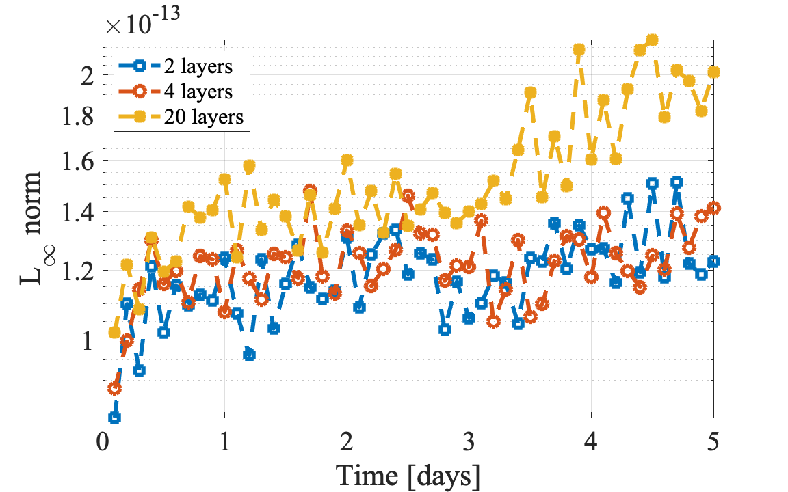

Examples
******************************

In the input file \filename{numo3d.in} the test cases are controlled by the 
input parameter 'icase'. h-NUMO contains the following ready-to-use test cases:
\begin{enumerate}
\item test_case = 'bump' is the perturbation in the bottom layer for the two-layer.
\item test_case = 'double-gyre' is a double-gyre test case.
\item test_case =  'lakeAtrest' is lake-at-rest test case.
\end{enumerate}

We present some examples of idealised modeling studies. To run these simulations change into the `Examples/` directory.

test_case = 'lakeAtrest': Well-balanced test
---------------------------------

This test case is used to validate the well-balanced property of the DG scheme for the multilayer equations. We have initialized the layers fluid domain with densities  :math:`\rho_k = 1027.01037 + 0.2110\times (k-1) \frac{kg}{m^3}, \ k = 1,\ldots,N_l` and the layer interface positions :math:`z_k = -40/N_l` m, where :math:`N_l` is the number of layers. The horizontal extend of the domain was :math:`(x,y)\in [0,\ 2000]\times[0,\ 2000]` m with wall boundary conditions on both ends, and the bottom topography is given by
    
.. math::
   :nowrap:

    \begin{equation}
        Z_b(x,y) = 3\left( 1 + \cos\left(\frac{\pi r}{250} \right)\right),
    \end{equation}

where :math:`r = \sqrt{(x-1000)^2 + (y-1000)^2}`.

   Cross-section of the free surface at time t = 3 hours

   Infinity norm of the free surface solution over 5 days

test_case = 'bump': Baroclinic wave propagation
----------------------------------------------------

This test case consists of a two-layer system. To test whether our model captures the wave propagation speeds correctly, we consider a small perturbation in the interface between layers of the lake-at-rest case with a flat bottom topography. The layer initial interface positions are :math:`z_0 = 0` m, :math:`z_1 = -20 + 0.5\left( 1 + \cos\left(\frac{\pi r}{250} \right)\right)` m and :math:`z_2 = -40` m. This test can be run with no-slip or free-slip boundary conditions, and more on these boundary conditions are in Sec.\ \ref{sec:boundary_conditions}.

.. figure:: ../figs/bump.*
   :alt: bump
   :width: 80%
   :align: center

   Free surface and interface of the second layer. The perturbation vertical scale is exaggerated in both panels.

test_case = 'double-gyre' Double-gyre test
------------------------------------

This test case consists of an idealized double-gyre benchmark test :cite:p:`bleck1986wind` to validate h-NUMO ability to simulate the mesoscale and submesoscale processes and compare the results with HYCOM. The domain is a closed rectangular ocean basin with a flat bottom. The forcing is spatially varying wind stress with intense western boundary currents, which, together with Coriolis force, results in a counter-clockwise circulation in the northern part and a clockwise circulation in the southern part of the domain. 

The horizontal extend is :math:`D = 2000\ km` in both the zonal and the meridional direction. The depth of the basin is :math:`10\ km` consisting of two layers, with the upper and lower layers initially having $:math:`1.5\ km` and :math:`8.5\ km` depths respectively. The densities in the layers are :math:`\rho_1 = 1027.01037\ \ kg/m^3` , :math:`\rho_2 = 1027.22136\ \ kg/m^3`. The Coriolis force is prescribed using a beta-plane approximation centered at :math:`45^\circ` N, with a parameter :math:`f = f_0 + \beta(y-D/2)`, where :math:`f_0 = 9.3 \times 10^{-4} \ s^{-1}` and :math:`\beta = 2 \times 10^{-11} \ m/s`. We consider two different values of the horizontal viscosity :math:`\nu = 50 \ m^2/s` and :math:`\nu = 500 \ m^2/s`, the dimensionless bottom drag coefficient in the linear bottom stress is :math:`c_d = 10^{-7} \ s^{-1}`, and we assume no shear stress between layers. The system is forced by a purely zonal wind stress :math:`\tau = (\tau_x,\ \tau_y)`, where :math:`\tau_x = -\tau_0\cos(2\pi y/D)`, :math:`\tau_y = 0\ N/m^2`, and :math:`\tau_0 = 0.1 \ N/m^2`. We considered two different boundary conditions: free-slip and no-slip. Each model year consists of 360 days, divided into 12 months, with 30 days per month.

.. figure:: ../figs/ssh_10km.gif
   :alt: Double-gyre
   :width: 80%
   :align: center

   Sea surface height with h-NUMO and HYCOM using the free-slip boundary condition and viscosity :math:`\nu = 50\ m^2/s`. The contour interval is 2 centimeters, with lower elevations in the northern region and higher elevations in the southern region.

